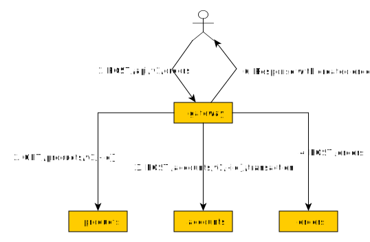

# TP3: client REST

Le but du TP est de créer la "Gateway" qui servira d'orchestrateur de nos services, en utilisant un client REST tel que spécifié par `eclipse.microprofile`. On apprendra à créer un client REST qui interroge un service.

Le schéma ci-dessous décrit les interactions entre la gateway et les micro-services lors du passage d'une commande.

## Structure du projet

Les classes de la gateway seront placées dans le package `gateway`. Ce package contiendra la classe `GatewayResourceV1` mappée sur le path `api/v1`.

À ce stade notre application est monolithique. Elle contient la gateway et les micro-services pour garder notre projet simple. En situation réelle nous aurions 4 projets distincts.

## Dépendance `quarkus-rest-client`

Ajouter la dépendance `quarkus-rest-client` qui va nous permettre de créer des clients vers les APIs REST de nos clients: https://quarkus.io/guides/rest-client

## Requête `GET api/v1/products`

Renvoie tous les produits.

- Créer le service `ProductsService` qui va permettre d'interroger l'API REST des produits
- Injecter et utiliser ce service dans `GatewayResourceV1` pour répondre à la requête `GET api/v1/products`

## Requête `GET api/v1/my-account`

Renvoie un `AccountModel` correspondant à l'utilisateur émettant la requête. En situation réelle, le serveur identifierait l'utilisateur au moyen d'un JWT placé dans les entêtes de la requêtes HTTP. À ce stade, on peut mettre l'identifiant de l'utilisateur en dur dans le code. Par contre le service interrogeant l'API REST des comptes doit prendre en paramètre l'identifiant de l'utilisateur.

## Requête `POST api/v1/orders`

Crée une nouvelle commande en implémentant le processus décrit dans le diagramme d'intéraction. On prendra garde à attraper les erreurs lors des différentes phases du processus et à appliquer des actions de __compensation__. Par ex, si le service des commandes échoue à créer une nouvelle commande, il faudra recréditer l'utilisateur et annuler le déstockage du produit.

Comme précédemment, on mettra en dur l'identifiant de l'utilisateur en dur dans le code de `GatewayResourceV1`.

Tester la bonne _compensation_ des erreurs:
- étant donné un utilisateur avec suffisamment de crédit, une commande qui ferait passer le stock du produit en négatif doit échouer en laissant toutes les données intactes.
- Étant donné un produit avec suffisamment de stock, une commande qui ferait passer le crédit de l'utilisateur en négatif doit échouer en laissant toutes les données intactes.

## Bonus

### Identification basique de l'utilisateur

Le but est de découvrir l'usage des _filtres_ que l'on peut appliquer avant le traitement d'une requête.

Nous allons simuler une identification de l'utilisateur par un token. Plutôt que de gérer un vrai token (JWT), nous allons simplement passer l'identifiant de l'utilisateur dans le header HTTP `Authorization`.
L'identifiant sera lu par le filtre `CheckIdentityFilter` qui se chargera de renvoyer le code `401 Unauthorized` si l'identifiant n'est pas présent ou invalide (pas un nombre). Si l'identifiant est correct, le filtre modifiera le `SecurityContext` de la requête en cours afin de lui donner le `Principal` (objet qui représente l'utilisateur connecté). Ce `SecurityContext` sera injecté comme variable membre de `GatewayResourceV1` afin de lui permettre de récupérer l'utilisateur courant.

À propos des filtres d'authentification: https://itnext.io/how-to-implement-a-jax-rs-authentication-filter-3eee64b34b99

#### 1ère étape: création du filtre

Créer la classe `gateway.CheckIdentityFilter` qui implémente `ContainerRequestFilter`. Dans la méthode `filter`, afficher simplement un message dans la console et vérifier que le message apparaît lorsqu'on émet des requêtes.

#### 2e étape: application du filtre seulement pour la gateway

Si on émet une requête sur l'API de la gateway, on voit que le filtre est appelé au moins 2 fois: une fois pour la requête de la gateway, une autre pour la méthode du micro-service appelé. On veut que le filtre ne soit appelé que pour la gateway.

- Créer l'annotation `CheckIdentity`
- Attacher l'annotation au filtre (annoter la classe par `@CheckIdentity`)
- Annoter `GatewayResourceV1` avec `@CheckIdentity`
- Vérifier que le filtre n'est appelé qu'une seule fois lors d'un appel à la gateway

Lien utile: https://stackoverflow.com/questions/23641345/jersey-request-filter-only-on-certain-uri

#### 3e étape: classe User

Créer une classe `gateway.User` qui implémente `java.security.Principal`. Un `User` stocke un identifiant.

#### 4e étape: implémentation du filtre

Dans la méthode `filter`:
- extraire l'identifiant de l'utilisateur ou échouer
- créer un nouveau User et l'associer au `SecurityContext` de la requête

#### 5e étape: utilisation de l'objet `User`

Remplacer l'identifiant de l'utilisateur en dur dans le code de la gateway, par l'id de l'utilisateur stocké dans le `SecurityContext`.

### Requête `GET api/v1/my-orders`

Renvoie les commandes de l'utilisateur courant.